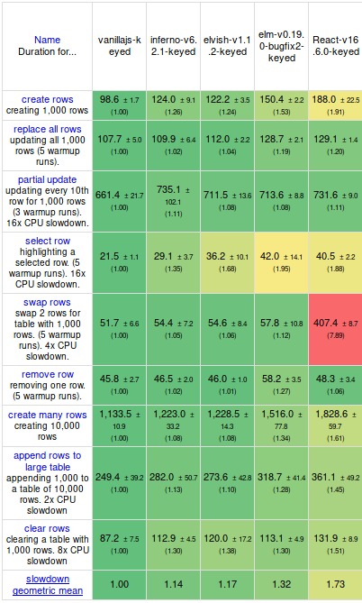

# Elvish
 A functional, reactive and some what type safe javascript library to build UIs 

Elvish is heavily inspired from elm-architecture, it is an effort to implement the type safe and functional architecture that elm provides in a non typed language like javascript.

Elvish uses [Inferno](https://github.com/infernojs/inferno) as its Vdom which makes it insanely fast, even faster than React and Elm itself.

Here is the jS-benchmark



## Basic Example

The logic of every Elvish program will break up into three cleanly separated parts:

- Model — the state of your application
- Update — a way to update your state
- View — a way to view your state as HTML

Here is a [Code Sandbox](https://codesandbox.io/s/km6jzkwk0r)

```javascript
import run from 'elvish';
import { onClick, Text, div, button, span } from "elvish";
import { Union, Record } from 'elvish'

const Model = Record({
  counter: Number
})

// init :: Model
const Init = Model.create(0)

// Msg = Increment | Decrement
const Msg = Union({
  Increment: [],
  Decrement: []
});

// update :: Model -> Msg -> Model
const Update = model => Msg.case({
  Increment: () => ({ ...model, counter: model.counter + 1 }),
  Decrement: () => ({ ...model, counter: model.counter - 1 }),
  _: () => model
})

// view :: Model -> Html Msg
const View = ({ counter }) =>
  div([], [
    button([ onClick(Msg.Increment) ], ["+"]),
    span([], [ Text(counter) ]),
    button([ onClick(Msg.Decrement) ], ["-"])
  ])

// Run
const Root = document.getElementById("root");

run({
  View,
  Update,
  Init,
  Root
});
```

## Side Effect example

```javascript
import run from "elvish";
import { div, button, h3, onClick, Text } from 'elvish'
import { Union, Record, Effect } from 'elvish'

const Model = Record({
  userId: Number,
  title: String,
  fetched: Boolean,
  url: String
})

// init :: Model
const Init = Model.create(0)('')(false)('https://jsonplaceholder.typicode.com/todos/1')

// Msg :: FetchData | FetchedData | FetchError
const Msg = Union({
  FetchData: [],
  FetchedData: [Number, String],
  FetchError: [String]
});

// getJson :: String -> Effect err { number, string }
const getJson = url => Effect((reject, resolve) =>
  fetch(url)
    .then(x => !x.ok ? reject('Error') : x.json())
    .then(resolve)
)

// fetchUserData :: String -> Effect FetchError FetchedData
const fetchUserData = url =>
  Effect.of(url)
    .chain(getJson)
    .bimap(err => Msg.FetchError(err), ({ userId, title }) => Msg.FetchedData(userId, title))

// update :: Model -> Msg -> Model | (Model, Effect)
const Update = model => Msg.case({
  FetchData: () => [model, fetchUserData(model.url)],
  FetchedData: (userId, title) => ({ ...model, userId, title, fetched: true }),
  FetchError: err => ({ ...model, title: err, fetched: true }),
  _: _ => model
})

// view :: Model -> Html Msg
const View = ({ userId, title, fetched }) =>
  div([],
    [
      button([onClick(Msg.FetchData)], [Text('Fetch Data')]),
      fetched && div([], [
        h3([], [Text(userId)]),
        h3([], [Text(title)])
      ])
    ]
  );


// Run
const Root = document.getElementById("root");

run({
  View,
  Update,
  Init,
  Root
});
```

## Types

### Record

- Example
```javascript
  const Model = Record({
    counter: Number,
    text: String
  }) // Returns a type constructor Model(counter, text)

  const model = Model.create(0, 'hello world') // create new Model

  console.log(model.counter) // 0
  console.log(model.text) // hello world
```

- Type safe

```javascript
  const Model = Record({
    counter: Number
  })

  const model = Model.create('0') // wrong type passed to record
```

### Union Type

Union types are an important part of an elvish application. 

- Example

```javascript
  const Bool = Union({
    True: [],
    False: []
  })
```

- Adding instance methods to union types.

```javascript
  const T = () => true

  const Maybe = Union({
    Just: [T],
    Nothing: []
  })
  
  Maybe.map = function(fn) {
    return Maybe.case({
      Nothing: () => Maybe.Nothing,
      Just: (v) => Maybe.Just(fn(v))
    }, this);
  };

  const just = Maybe.Just(1)
  const nothing = Maybe.Nothing
  nothing.map(add(1)); // => Nothing
  just.map(add(1)); // => Just(2)
```

- Pattern Matching

```javascript
  const Action = Union({
    ShowNumber: [Number],
    HideNumber: []
  })

  const initState = {
    number: 0,
    showNumber: false
  }

  const reducer = (initState, action) =>
    Action.case({
      ShowNumber: number => ({ showNumber: true, number }),
      HideNumber: _ => ({ showNumber: false, number: 0 })
      _: () => initState,
    }, action)
```

### Effect type

Effect types are used to run side effects in an elvish application. Effects is a structure for time-dependent values.

Basically the idea is to abstract the side effects from your pure code and running them separately, so your code stays pure even when you are doing side effects.

You can think of an elvish application as pure and functional code running in an imperative shell.

- Example

```javascript
  const executeEffect = number =>
    Effect.of(number)
      .map(x => x + 10)
```
Only way to run Effects in an elvish application is to return a tuple from the update function containing [ Model, Effect ].

```javascript
  ExecuteEffect: () => [model, executeEffect(model.number)],
```

#### Instances

```javascript

  // Constructing
  Effect.of(value)
  //  b -> Effect(a, b)
  // Constructs a new Effect containing the given successful value.

  Effect.rejected(value)
  // a -> Effect(a, b)
  // Constructs a new Effect containing the given failure value.

  Effect.empty()
  // () -> Effect(a, b)
  // Constructs a Effect that will never resolve.

  // Transforming
  Effect.map(transformation)
  // Effect(a, b) => (b -> c) -> Effect(a, c)
  // Transforms the successful value of the Effect using a regular unary function.

  Effect.chain(transformation)
  // Effect(a, b) => (b -> Effect(a, c)) -> Effect(a, c)
  // Transforms the succesful value of the Effect using a function over monads.

  Effect.orElse(transformation)
  // Effect(a, b) => (a -> Effect(c, b)) -> Effect(c, b)
  // Transforms the failure value of the Effect into a new Effect.

  Effect.fold(onRejection, onSucecss)
  // Effect(a, b) => (a -> c), (b -> c) -> Effect(d, c)
  // Applies a function to each side of the Effect.

  Effect.cata(pattern)
  // Effect(a, b) => { Rejected: a -> c, Resolved: b -> c } → Effect(d, c)
  // Applies a function to each side of the Effect.

  Effect.bimap(onRejection, onSuccess)
  // Effect(a, b) => (a -> c), (b -> d) -> Effect(c, d)
  // Maps both sides of the Effect.

```